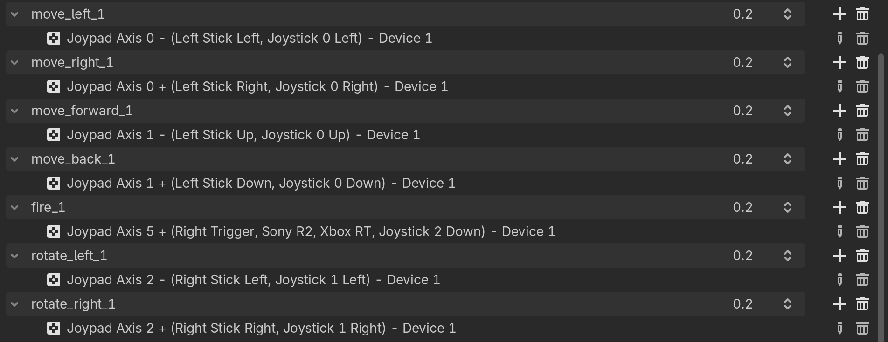
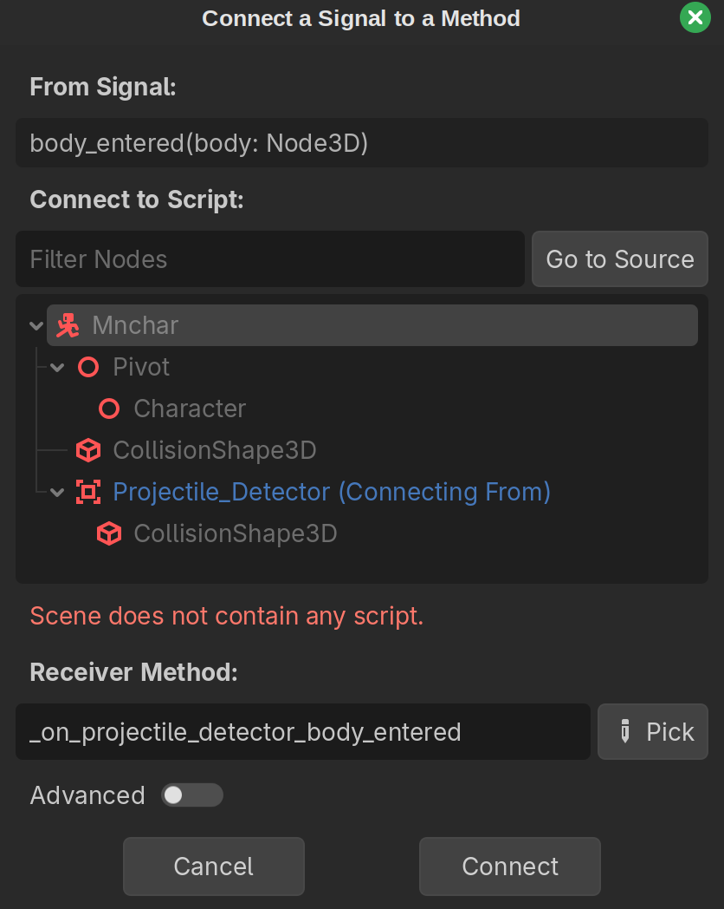
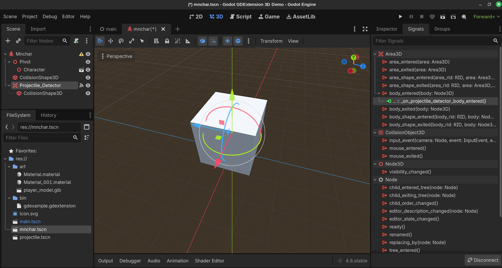
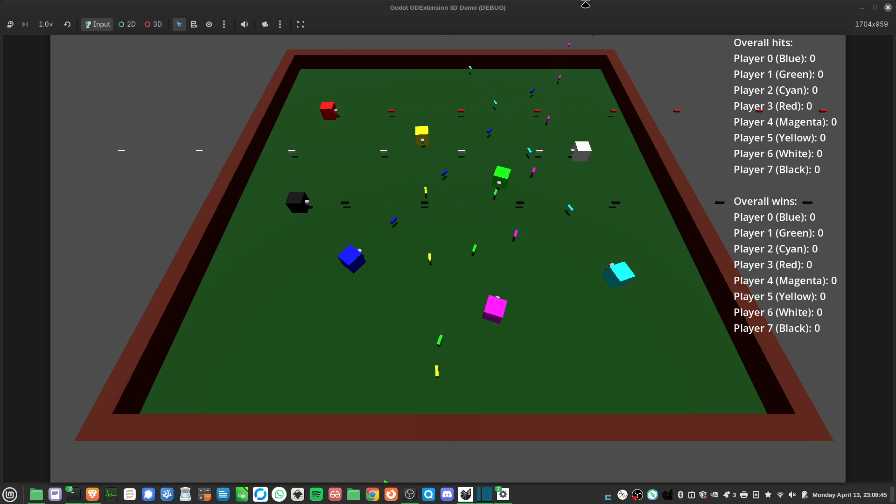

# Cube Combat

*A 3D Godot demo created using C++*


By Ken Burchfiel

Released under the MIT License. (See LICENSE.md file for additional details)

*Note: I chose not to use generative AI tools to write this project's code or this Readme. It was important for me to understand what the code was doing, and I felt that LLMs would get in the way of that.*

## Introduction

Cube Combat is a 3D 3rd-person-shooter game that supports between two to eight players. It is coded entirely in C++ using Godot's GDExtension feature and the godot-cpp (https://github.com/godotengine/godot-cpp) library.

I created this project primarily in order to learn how to use GDExtension, together with Godot 4.6, to create a game in C++. Now that the project is more or less complete, I hope it can be a useful resource for other newcomers to C++ in Godot. 

## References and resources I used to create this project

(This list is incomplete; additional resources are mentioned within the code.)

* [Version 4.6 of the Getting Started GDExtension documentation page (GDEGS)](https://docs.godotengine.org/en/4.6/tutorials/scripting/cpp/gdextension_cpp_example.html)

* [Version 4.6 of the Your first 3D Game tutorial (YF3DG)](https://docs.godotengine.org/en/4.6/getting_started/first_3d_game/index.html) 

    This tutorial doesn't include C++ references, but its GDScript and C# code snippets provide valuable 'hints' about what C++ classes, methods, and functions to use. The instructions provided for setting up a 3D project within Godot were very helpful as well, of course.

* [godot-cpp library (godot-cpp)](https://github.com/godotengine/godot-cpp) 

    The *compiled* version of this library is an indispensable C++ reference.

    Note: I used the latest master version of this repository available on 2026-03-06 (9ae37ac). This particular version can be found [at this link](https://github.com/godotengine/godot-cpp/tree/9ae37ac8b9b14df5284dc3d4bf87e7d8b3327503).

* My [C++-based Your First 2D Game tutorial (YF2DGC++)](https://github.com/kburchfiel/cpp_yf2dg_gd_4pt_6/tree/main)--which is based heavily on [a similar tutorial by J-Dax for Godot 4.3](https://github.com/j-dax/gd-cpp). (That tutorial was released under the BSD 3-Clause license; my copy is released under the MIT license.)

* Also of note is Vorlac's GDExtension documentation, available at https://vorlac.github.io/gdextension-docs/getting_started/quick-start/ . I ought to give this document a thorough read at some point, as it should help clarify many points of confusion! (Note, however, that at least some of it is AI-generated, so as Vorlac notes, it should be used with caution.)

* The [example.cpp](https://github.com/godotengine/godot-cpp/blob/master/test/src/example.cpp) file within the godot-cpp repository proved extremely helpful as well.


## Steps involved in creating this project

(Note: More details on the code, including additional documentation and relevant links, can be found within the src/ folder. I also plan to create a more detailed step-by-step guide at some point in the future in order to make this project easier for others to replicate.)

### Part 1: Initial setup

For my initial setup, I started with the source code found in GDEGS, but then updated it to accommodate my 3D setup. For instance, rather than use a Sprite2D as the basis for my 'Mnchar' (main character) class, I used CharacterBody3D, as this was the class referenced in YF3DG. (More on this in the following section.) 

After compiling my code, I updated my project within the Godot editor to include a floor; a camera; a light source; and a shape for the player. (I had created this shape for [a GDNative C++ project back in 2023](https://github.com/kburchfiel/godot_demo_3d_gdnative_cpp_project).) When I added my Mnchar class to the project, I confirmed that it moved in a somewhat-circular fashion as instructed by my code:

    ```
    Vector3 new_position = Vector3(10.0 + (10.0 * sin(time_passed * 2.0)), 10.0 + (10.0 * cos(time_passed * 1.5)), 0);
    ```

    (This code was based on similar code within GDEGS; I simply replaced 'Vector2' with 'Vector3' and added a 0 at the end to represent the third dimension.)

Here's what things looked like at this point:


### Part 2: Basic player movement

To get the player to move, I translated some of the GDScript code found in the [Moving the player with code](https://docs.godotengine.org/en/4.6/getting_started/first_3d_game/03.player_movement_code.html) section of YF3DG to C++. (The [player.cpp code within YF2DGC++](https://github.com/kburchfiel/cpp_yf2dg_gd_4pt_6/blob/main/src/entity/player.cpp)--which is [mostly J-Dax's own code](https://github.com/j-dax/gd-cpp/blob/main/src/entity/player.cpp)--proved helpful here.) I skipped the jump-related code and simply worked on getting the player to move left, right, forward, back, and diagonally using the arrow keys. (I was also able to get the player to rotate in the direction of its movement.)

This process also involved adding some movement commands to my project's input map as instructed by YF3DG.

(Note: At one point, the player's `movement_speed` attribute wasn't appearing within my project editor. However, when I later reopened the editor, the attribute then appeared.)

I later modified this code to allow the player to strafe and rotate, thus freeing up many more movement options.


### Part 3: Setting up projectiles

Since Godot's [Third Person Shooter](https://github.com/godotengine/tps-demo) demo uses the CharacterBody3D class for its bullets, I decided to do the same. (Since this is also the class on which my Mnchar (player) class is based, I copied and pasted my mnchar.h and mnchar.cpp code as a basis for my projectile code.)

I added lines of code for my new Projectile class (e.g. `#include "projectile.h"` and `GDREGISTER_CLASS(Projectile);` to register_types.cpp.

Within the editor, I created a new scene (which I named projectile.tscn); chose my Projectile class as the root node; and added a Node3D as a child (which I named Pivot); added a MeshInstance3D to this Node3D. (These steps were based both on https://docs.godotengine.org/en/4.6/getting_started/first_3d_game/02.player_input.html and on https://kidscancode.org/godot_recipes/4.x/3d/rolling_cube/index.html). Since I wanted to make my projectile a green rectangular prism, I turned the MeshInstance3D into a box mesh; added a 'StandardMaterial3D' material; changed its albedo to green (#00FF00); and changed the x, y, and z values of its scale to 0.3, 0.3, and 1, respectively.

Next, I added a CollisionShape3D to the Projectile class; chose a BoxShape3D for its Shape entry; and changed its scale to the same values (0.3, 0.3, and 1 for x, y, and z, respectively) that I had chosen for my MeshInstance3D.

I then added in code that made the projectile.tscn scene accessible to my Mnchar class. This way, the Mnchar class could fire bullets by loading the projectile.tscn file; casting this scene to a projectile; and then initializing the projectile's transform with the player's transform. (A crucial part of this process involved reloading the editor after updating my code; going to the Mnchar entry within my main.tscn scene tree; clicking on the new Packed Scene entry within the Inspector menu; and choosing the projectile.tscn file.)

I then updated my projectile.cpp and Mnchar.cpp code to ensure that the bullets would travel in the same direction that the player was facing. This involved a decent amount of trial and error. Some key steps were (1) to initialize the bullet's transform as the Mnchar's Pivot's local transform (as it's that Pivot, rather than the Mnchar itself, that we adjust when moving the player); (2) to perform a local translate of the pivot's transform so that the bullets would start a little ways away from the player; and (3) to adjust the projectile's basis so that the bullets would travel in the intended direction. I also needed to add the bullet as a child of the player's parent scene so that the player's subsequent movement wouldn't affect the bullet's movement.


### Part 4: Adding multiplayer support

Now that I had a simple, but functional, player class (Mnchar), I wanted to make it possible for multiple players to control multiple Mnchar objects independently. 

To prepare for multiplayer gameplay, I moved my Mnchar class to its own scene, then added two copies of this scene to main.tscn. At first, the game crashed (with a Signal 11 error code) when I attempted to do so; I eventually realized that this was because the Mnchar code references a Pivot class, and this class needed to be present before I could successfully add my Mnchar class. Thus, I  (1) initialized my Mnchar scene (mnchar.tscn) as a CharacterBody3D node; (2) added a Node3D as a child of this node; (3) renamed that Node3D to 'Pivot'; and (4) changed the CharacterBody3D node to a Mnchar node. 

The easiest option for enabling multiplayer functionality, as shown in some online guides, would be to delegate different parts of the keyboard to different players. However, this wasn't ideal for two main reasons. First, I wanted players to be able to use video game controllers to play the game, and it would be tricky to delegate different parts of the controllers to different actions. (Even if I did so, mischievous players could then just hit the buttons corresponding to the other player's movements anyway!)

But more importantly, I wanted to allow up to 8 players to compete at the same time--which more or less necessitated that I allow the same buttons on different controllers to map to different players' inputs.

I implemented a multiplayer setup as follows. First, I updated my project's input map (accessible via Project --> Project Settings --> Input Map) so that it would have multiple copies of each input. (I started with two copies for a 2-player game, but I can later expand this to eight copies.) I added a numerical suffix to the names of these inputs (e.g. "move_right_0", "move_right_1") in order to distinguish them from one another.

Next, I used those same numbers to specify which device would be linked with that input. (All movements ending in "_0" would be linked to Device 0; all movements ending in "_1" will be linked to Device 1; and so on. There are eight device numbers (ranging from 0 to 7) to choose from.

Here are all of my "_1" inputs: (There's a similar set of "_0" inputs, though those are also mapped to keyboard inputs for convenience's sake.)




The final step was to update my code such that each player could be linked to one, and only one, set of these inputs. I first added a new String variable (`mnchar_id`) that could store a unique ID for each Mnchar. I made this variable accessible within the editor using my existing `movement_speed` variable as a reference. I then added this ID as a suffix to my original input commands. Here's an example from `Mnchar::_physics_process()` within mnchar.cpp:

```
  x_direction = input->get_axis("move_left_"+mnchar_id, 
    "move_right_"+mnchar_id);
```

If the character's mnchar_id is 0, the code will use `move_left_0` and `move_right_0` as the basis for its input. Meanwhile, if `mnchar_id` is 1, the code will listen for `move_left_1` and `move_right_1` for its inputs. Since the `_0` movements and `_1` movements are mapped to different devices, this approach allows different devices to get mapped to different players. 

A crucial step here, of course, is to make sure that each Mnchar has a different mnchar_id. I accomplished this within the editor, but I'm quite sure this can be achieved via code as well (which would be helpful if I used C++ code, rather than the editor, to add Mnchar objects to the game area.)

The following resources helped me figure out this approach:

    https://www.reddit.com/r/godot/comments/13ikz4u/best_way_to_handle_controller_input_for_local/

    https://github.com/remram44/godot-multiplayer-example

    https://www.gdquest.com/library/split_screen_coop/

    https://godotassetlibrary.com/asset/QdddqG/multiplayer-input

    https://kidscancode.org/godot_recipes/3.x/2d/splitscreen_demo/index.html


### Part 5: Removing players upon collision with a projectile

This step involved adding a `Mnchar::_on_projectile_detector_body_entered()` function within mnchar.cpp and mnchar.h; creating a new Area3D node within the Mnchar.tscn file in the editor and connecting its `on_body_entered` signal to this function (see screenshots below); and updating the collision layers and masks for the Mnchar and Projectile classes. (The [Jumping and squashing monsters](https://docs.godotengine.org/en/4.6/getting_started/first_3d_game/06.jump_and_squash.html) section of Godot's Your First 3D Game tutorial proved very helpful here.)



*Connecting the signal*



*The player's Signals list following this update*

In addition, I updated my projectile code to remove projectiles from the screen after they have been active for at least one second.

### Part 6: Creating separate colors for each Mnchar and its corresponding projectiles

I wanted to assign different colors to different main-character objects in order to make them easier to distinguish. This first involved recreating the mesh used for my Mnchar object in Godot; I had created it in Blender a while back, but I figured that reconstructing it in Godot would allow for more flexibility. (Since each Mnchar's shape is simply a 2x2x2 cube with a 0.25x0.25x0.25 'turret' attached to the front, this didn't take long to accomplish at all.)

Next, I created a second copy of my mnchar.tscn and projectile.tscn scenes, then assigned _0 and _1 suffixes to their filenames. I made the albedos of the Mnchar and Projectile objects in mnchar_0.tscn and projectile_0.tscn to red; next, I made the Mnchar and Projectile objects in mnchar_1.tscn and projectile_1.tscn green. (I also set the ID of the Mnchar in mnchar_1.tscn to 1; the ID of the Mnchar in mnchar_0.tscn was kept as 0. That way, each player could be controlled independently as discussed earlier.

### Part 7: Simplifying player setup

With help from RamblingStranger on discord (https://discordapp.com/channels/212250894228652034/342047011778068481/1487545947608322078), I was able to update Mnchar colors within my C++ code based on Mnchar IDs. I also added main.cpp and main.h scripts that configure, then add, Mnchar characters into the game area. (This will make my game setup more flexible, as it will ultimately allow players to specify how many main characters to add to the game.)

### Part 8: Configuring a HUD and a simple start menu

At this point, the game was configured to begin immediately with two players whenever it was launched. I instead wanted to allow the players to choose how many characters to include, *then* begin the game.

To implement this feature, I created a new Hud class, then instantiated it as a child of my Main.tscn scene. I then created a _process function within Hud that would let me both (1) specify the number of characters to include and (2) start the game when requested by the user. I added a "start_game" signal to my Hud code and connected it to an _on_hud_start_game function within Main.cpp that would (1) retrieve the number of players requested by the player and (2) add that number of players to the scene.

I still need to add in player inputs, colors, and start locations to accommodate 3-8 players, but the game is close to being able to support up to 8 players at this point.

### Part 9: Adding in maps

I then added in two TypedDictionaries within main.h, one for player colors and one for starting locations, that my main.cpp code could use to determine which starting locations and values to assign to each player. I'll need to modify these starting locations to make them more even, however; in addition, I'll need to add in code that rotates each player towards the center. (All are currently facing away from the camera, which isn't ideal for 3 out of the 4 sides of the game area.)

### Part 10: Determining a winner

In order to figure out who (if any) won the game, I first needed to create a set that would store all active Mnchar IDs. Next, I updated my mnchar.cpp code such that each Mnchar would emit a signal after being hit. By connecting this signal to my main.cpp code, I could remove Mnchars from the active-Mnchar set upon being hit. (This also required that I connect the Mnchar's signal to a function within main.cpp within my main.cpp code, since a Mnchar is not part of my Main.tscn scene.)

I then added in code that would send game-over information to my Hud scene once this set contained fewer than 2 characters. As part of this update, I also allowed the player-selection menu to return once a given game was complete.

### Part 11: Sharing statistics for the most recent game and all games within the session thus far
I also wanted the game to show information about how many hits each player had scored within the most recent game--along with how many hits (and wins) each player had achieved across rounds. In order to implement these updates, I first allowed information about the firing Mnchar's ID to get stored within each projectile. Next, I updated my `Mnchar::_on_projectile_detector_body_entered` command so that it could extract these firing-Mnchar IDs, then send them over to main.cpp's `on_mnchar_mnchar_hit()` function.

I then added dictionaries that could store current-game hit counts for each player as well as overall hit and win counts. Additional code updates allowed these dictionaries' data to get updated whenever a player got hit or a game ended. Next, I updated my end-of-game code to output the contents of the current-game-hits dictionary along with the winner. I also created a function (`Main::update_constant_message()`) that would convert the information in my overall hits and wins dictionaries into a string, then display that string within a new Label child of my Hud class.


### Part 12: Adding a reset option and making other improvements
Although it's handy to have a running tally of overall stats, I realized it would also be useful for players to be able to reset these stats. For instance, players may want to be able to play an initial practice round in which they can get used to the controls and identify their character, then reset their stats so that this round 'doesn't count.' 

Therefore, I added in a new input (reset_overall_stats_0) that, when pressed continuously for two seconds, would replace the existing overall-stats dictionaries with empty ones. I plan to map this to the left trigger, since this button isn't currently used for any other purpose.

I also made several other improvements at this point. First, I added in a dictionary of color names (e.g. 'Blue', 'Green') that would allow players to identify the character corresponding to each ID. Second, I added in code that makes projectile colors equal to their firing characters' colors. Third, I added a dictionary of rotation values that allow all players to face towards the center of the screen.

### Part 13: Creating a more flexible player selection setup

I had previously specified the number of players to include in each round by having the first player choose
a number between 2 and 8; however, this setup isn't that flexible, since players may want to sit some games out and then come back later. Therefore, I updated hud.cpp to allow players to add themselves to the game by clicking the Fire button on their controllers. That way, players can decide whether or not to join each game. 

I also updated my code for resetting overall stats to allow any player, not just the first player, to reset these statistics. In addition, any player can now launch a game by pressing both the reset_overall_stats *and* fire buttons. (However, I still need to add in all of the corresponding button mappings within the editor.)

### Part 14: Adding walls and inputs

Using [this answer by eagleDog](https://stackoverflow.com/a/79419758/13097194) as a reference, I added walls around my game area that would prevent players from being able to leave it. 

In addition, I began adding input settings for additional devices in order to accommodate my multiplayer setup. To reduce the number of repetitive steps needed to complete this project, I created a C++ script (available within this repository as /input_map_creator/input_map_creator.cpp) that would allow me to create duplicate input settings for each device ID. For more details on this approach, along with other required steps, see the input_map_creator.cpp file.

(To be honest, simply creating these inputs within the editor may have been simpler, as this process involved some busywork also. Nevertheless, getting to practice C++ is rarely a bad thing! :) 

(Thanks to quentincaffeino on Reddit for helping inspire this approach: https://www.reddit.com/r/godot/comments/k4xcqh/comment/gebibku)

Now that I had a working, 8-player game, I decided to finish up this project and revise my code. There are plenty of ways the code (and game) could further be extended and improved, but I figured that this would be a decent stopping point. My next step will be to create a step-by-step guide that can help newcomers (like myself!) to C++ in Godot to become familiar with the GDExtension system. 

I hope that this project will prove useful in your own game-development endeavors!




## Troubleshooting notes

* I sometimes found, particularly after compiling my C++ code, that the Projectile.tscn scene would sometimes disappear from my Packed Scene entry within my Mnchar's properties. (An "empty" message would appear in its place.) This would then cause the game to crash if I attempted to fire a projectile, as Godot wouldn't know what scene to use as the basis for projectiles. I'm not sure whether this is due to a glitch within Godot 4.6 or some issue with my own setup, but either way, the fix was thankfully quite simple: I simply had to reload the projectile.tscn scene, a process that takes only a few clicks.

    * However, I think this *also* sometimes caused the editor to crash when I attempted to reopen the editor. (I think what happened was that (1) the Mnchar.tscn reference within main.tscn got lost; (2) the editor then attempted to open an active Main scene; and (3) it then crashed because it didn't know what packed scene to load. Removing the reference from my code (e.g. by removing 
    `reinterpret_cast<Mnchar*>(get_mnchar_scene()->instantiate());` from main.cpp or adding `return` before that line); recompiling the script; loading the scene; adding the reference; and then recompiling the script helped fix this.

    [Note to self: the packed scene entry within main.tscn consists of two lines. The first line, 
    located right below `[gd_scene format=3 uid="uid://cqow47bch5ocs"]`, reads:

    `[ext_resource type="PackedScene" uid="uid://dc3nje2ppsfhy" path="res://mnchar.tscn" id="1_ig7tw"]`

    Another line, located right below `[node name="Main" type="Main" unique_id=1443214972]`, reads:

    `packed_scene = ExtResource("1_ig7tw")`

    Similarly, for the mnchar.tscn file, below the line

    `[gd_scene format=3 uid="uid://dc3nje2ppsfhy"]`, you should see:

    `[ext_resource type="PackedScene" uid="uid://ckhuieb6lfi2" path="res://projectile.tscn" id="1_0j8lf"]`

    Then, below `[node name="Mnchar" type="Mnchar" unique_id=1052373598]`, you should see:

    `packed_scene = ExtResource("1_0j8lf")`

    If the game crashes again, try pasting these lines into your main.tscn and mnchar.tscn files.]

* As mentioned within the Multiplayer section: If you're trying to add a GDExtension class to a scene, make sure that the child nodes referenced by your C++ code (e.g. the Pivot node in the case of the Mnchar class) are present within the editor. See the Multiplayer section for more details.

* My game crashed when I attempted to use a std::Map() to assign colors to players based on their ID. Therefore, I used a TypedDictionary (see https://docs.godotengine.org/en/stable/engine_details/architecture/core_types.html) instead.

* If you're trying to add a new GDExtension scene, you'll need to make sure that all the nodes referenced by that scene are present within your code. For instance, before you can make the Hud class the root node of hud.tscn, you'll need to make sure to have a Label named 'Message' present as a child of your root node. 

This might seem like a Catch 22: how can you create a child of a root Hud node if you can't add the Hud node to begin with? The solution is to make the class that your GDExtension class extends (CanvasLayer, in the case of Hud) the root node of the scene; add all child nodes referenced by the code to it; and *then* switch the extended class to a Hud class. (You can do so by right-clicking on the extended class (e.g. CanvasLayer); selecting 'Change Type'; and then selecting your GDExtension class. You may then want to rename the class to your GDExtension class in order to avoid any confusion.)

* If the Godot editor doesn't appear to know about a newly-created GDExtension class, try restarting it. If it still doesn't appear, make sure you've added a reference to this class within your register_types.cpp file. (For instance, to get a custom Hud class to appear, make sure to (1) add `GDREGISTER_CLASS(Hud)` within register_types.cpp's initialization function (called `initialize_example_module()` in this project) and (2) add `#include "hud.h"` within your list of include statements.

* If one or more of your GDExtension classes suddenly show up as missing within the editor (as indicated by red Xs next to their name), you might have an issue with one of the functions that you've bound as a method (or its corresponding `bind_method()` function). Try commenting out such functions as needed until the class reappears within Godot, then revise your code as needed. (In one case, I had forgotten to add `Main::` or `Mnchar::` before one of my bound functions in its .cpp file--which then caused all of my classes to fail to load. Adding that text back in resolved the issue.)

## Finding C++ code equivalents to GDScript code

When first getting acquainted with C++ in Godot, you might wonder how you can find C++ code equivalents for the GDScript code found within tutorials and other documentation materials. My search for a C++-based CharacterBody3D class shows what this process might look like for you. 

Since YF3DG has GDScript and C# (but not C++) code excerpts, I first needed to double-check the name for this class within the C++ API. A content search within my godot-cpp library for 'characterbody' turned up two relevant code files: 

    * godot_cpp/classes/character_body3d.hpp (I needed to include this file within the C++ code for my main-character file.)

    * godot-cpp/gen/src/classes/character_body3d.cpp

Using these files, I was able to confirm that this class is also titled CharacterBody3D within the C++ API. I also confirmed that this class has the `move_and_slide()` function referenced within YF3DG. (A content search for `move_and_slide` would also have helped me locate the character_body3d.cpp file.)

Certain C++ API code, however, may not have any GDScript equivalent. In that case, you may need to instead look at the reference information for the Godot Engine's own source code--or directly at the code itself. For example, the Core Types page (https://docs.godotengine.org/en/stable/engine_details/architecture/core_types.html) was a huge help when adding dictionaries and sets into my code.

Of course, existing code that makes use of the C++ API can be very useful as well. For instance, the source code for the 'test' section of the godot-cpp project (https://github.com/godotengine/godot-cpp/tree/master/test/src), such as the example.cpp file (https://github.com/godotengine/godot-cpp/blob/master/test/src/example.cpp), was a lifesaver when I was trying to figure out how to get a TypedDictionary to work with my project. See the 'References and resources' section near the top of this page for more examples.


