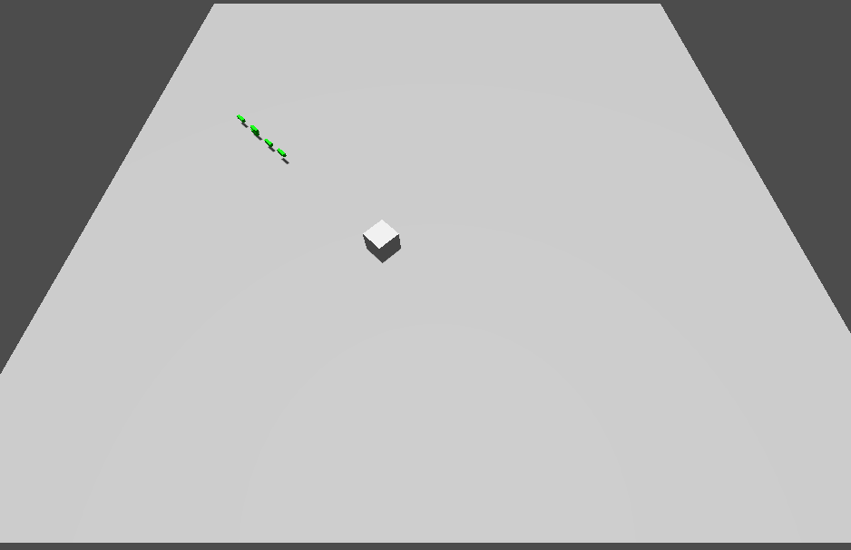

## Godot 3D Demo using C++ and GDExtension

(A *very* early work in progress!)

By Ken Burchfiel

Released under the MIT License

This project is an opportunity for me to *learn* how to use GDExtension, together with Godot 4.6, to create a game in C++. For my own reference, I'm planning to note some of the steps I took here; additional comments will be found within the project's src folder (which will contain my game's code).

### References and resources I used to create this project:

* [Version 4.6 of the Getting Started GDExtension documentation page (GDEGS)](https://docs.godotengine.org/en/4.6/tutorials/scripting/cpp/gdextension_cpp_example.html)

* [Version 4.6 of the Your first 3D Game tutorial (YF3DG)](https://docs.godotengine.org/en/4.6/getting_started/first_3d_game/index.html) 

    This tutorial doesn't include C++ references, but its GDScript and C# code snippets provide valuable 'hints' about what C++ classes, methods, and functions to use. The instructions provided for setting up a 3D project within Godot were very helpful as well, of course.

* [godot-cpp library (godot-cpp)](https://github.com/godotengine/godot-cpp) 

    The *compiled* version of this library is an indispensable C++ reference.

    Note: I used the latest master version of this repository available on 2026-03-06 (9ae37ac). This particular version can be found [at this link](https://github.com/godotengine/godot-cpp/tree/9ae37ac8b9b14df5284dc3d4bf87e7d8b3327503).

* My [C++-based Your First 2D Game tutorial (YF2DGC++)](https://github.com/kburchfiel/cpp_yf2dg_gd_4pt_6/tree/main)--which is based heavily on [a similar tutorial by J-Dax for Godot 4.3](https://github.com/j-dax/gd-cpp). (That tutorial was released under the BSD 3-Clause license; my copy is released under the MIT license.)


## Part 1: Initial setup

For my initial setup, I started with the source code found in GDEGS, but then updated it to accommodate my 3D setup. For instance, rather than use a Sprite2D as the basis for my 'Mnchar' (main character) class, I used CharacterBody3D, as this was the class referenced in YF3DG. (More on this in the following section.) 

After compiling my code, I updated my project within the Godot editor to include a floor; a camera; a light source; and a shape for the player. (I had created this shape for [a GDNative C++ project back in 2023](https://github.com/kburchfiel/godot_demo_3d_gdnative_cpp_project).) When I added my Mnchar class to the project, I confirmed that it moved in a somewhat-circular fashion as instructed by my code:

    ```
    Vector3 new_position = Vector3(10.0 + (10.0 * sin(time_passed * 2.0)), 10.0 + (10.0 * cos(time_passed * 1.5)), 0);
    ```

    (This code was based on similar code within GDEGS; I simply replaced 'Vector2' with 'Vector3' and added a 0 at the end to represent the third dimension.)

Here's what things looked like at this point:


## Part 2: Basic player movement

To get the player to move, I translated some of the GDScript code found in the [Moving the player with code](https://docs.godotengine.org/en/4.6/getting_started/first_3d_game/03.player_movement_code.html) section of YF3DG to C++. (The [player.cpp code within YF2DGC++](https://github.com/kburchfiel/cpp_yf2dg_gd_4pt_6/blob/main/src/entity/player.cpp)--which is [mostly J-Dax's own code](https://github.com/j-dax/gd-cpp/blob/main/src/entity/player.cpp)--proved helpful here.) I skipped the jump-related code and simply worked on getting the player to move left, right, forward, back, and diagonally using the arrow keys. (I was also able to get the player to rotate in the direction of its movement.)

This process also involved adding some movement commands to my project's input map as instructed by YF3DG.

(Note: At one point, the player's `movement_speed` attribute wasn't appearing within my project editor. However, when I later reopened the editor, the attribute then appeared.)

I later modified this code to allow the player to strafe and rotate, thus freeing up many more movement options.


## Part 3: Setting up projectiles

Since Godot's [Third Person Shooter](https://github.com/godotengine/tps-demo) demo uses the CharacterBody3D class for its bullets, I decided to do the same. (Since this is also the class on which my Mnchar (player) class is based, I copied and pasted my mnchar.h and mnchar.cpp code as a basis for my projectile code.)

I added lines of code for my new Projectile class (e.g. `#include "projectile.h"` and `GDREGISTER_CLASS(Projectile);` to register_types.cpp.

Within the editor, I created a new scene (which I named projectile.tscn); chose my Projectile class as the root node; and added a Node3D as a child (which I named Pivot); added a MeshInstance3D to this Node3D. (These steps were based both on https://docs.godotengine.org/en/4.6/getting_started/first_3d_game/02.player_input.html and on https://kidscancode.org/godot_recipes/4.x/3d/rolling_cube/index.html). Since I wanted to make my projectile a green rectangular prism, I turned the MeshInstance3D into a box mesh; added a 'StandardMaterial3D' material; changed its albedo to green (#00FF00); and changed the x, y, and z values of its scale to 0.3, 0.3, and 1, respectively.

Next, I added a CollisionShape3D to the Projectile class; chose a BoxShape3D for its Shape entry; and changed its scale to the same values (0.3, 0.3, and 1 for x, y, and z, respectively) that I had chosen for my MeshInstance3D.

I then added in code that made the projectile.tscn scene accessible to my Mnchar class. This way, the Mnchar class could fire bullets by loading the projectile.tscn file; casting this scene to a projectile; and then initializing the projectile's transform with the player's transform. (A crucial part of this process involved reloading the editor after updating my code; going to the Mnchar entry within my main.tscn scene tree; clicking on the new Packed Scene entry within the Inspector menu; and choosing the projectile.tscn file.)

I then updated my projectile.cpp and Mnchar.cpp code to ensure that the bullets would travel in the same direction that the player was facing. This involved a decent amount of trial and error. Some key steps were (1) to initialize the bullet's transform as the Mnchar's Pivot's local transform (as it's that Pivot, rather than the Mnchar itself, that we adjust when moving the player); (2) to perform a local translate of the pivot's transform so that the bullets would start a little ways away from the player; and (3) to adjust the projectile's basis so that the bullets would travel in the intended direction. I also needed to add the bullet as a child of the player's parent scene so that the player's subsequent movement wouldn't affect the bullet's movement.



## Next steps:

1. Find a way to set up multiplayer such that (1) all players can use the same buttons (e.g. left and right joysticks) to move, and (2) you can easily support anywhere from 2 to 8 players. (As a prerequisite, you'll also want to create a Main class and script that can govern the addition of an arbitrary number of players; check the C++ version of YF2DG for a template to get you started.) Resources that may help you get there include:

https://www.reddit.com/r/godot/comments/13ikz4u/best_way_to_handle_controller_input_for_local/

https://github.com/remram44/godot-multiplayer-example

https://www.gdquest.com/library/split_screen_coop/

https://godotassetlibrary.com/asset/QdddqG/multiplayer-input

https://kidscancode.org/godot_recipes/3.x/2d/splitscreen_demo/index.html

**Note:** The Input Map screen within the Project Settings guide lets you specify for which device (Device 0, Device 1 . . . Device 7) a particular action should be applied. This should help you map different players' actions to different controllers.

1. Find a way to delete each bullet after a period of time

2. Add in an enemy character and/or other player characters (for a multiplayer battle or co-op setup)


### An aside: Finding C++ code equivalents to GDScript code

When first getting acquainted with C++ in Godot, you might wonder how you can find C++ code equivalents for the GDScript code found within tutorials and other documentation materials. My search for a C++-based CharacterBody3D class shows what this process might look like for you. 

Since YF3DG has GDScript and C# (but not C++) code excerpts, I first needed to double-check the name for this class within the C++ API. A content search within my godot-cpp library for 'characterbody' turned up two relevant code files: 

    * godot_cpp/classes/character_body3d.hpp (I needed to include this file within the C++ code for my main-character file.)

    * godot-cpp/gen/src/classes/character_body3d.cpp

Using these files, I was able to confirm that this class is also titled CharacterBody3D within the C++ API. I also confirmed that this class has the `move_and_slide()` function referenced within YF3DG. (A content search for `move_and_slide` would also have helped me locate the character_body3d.cpp file.)


